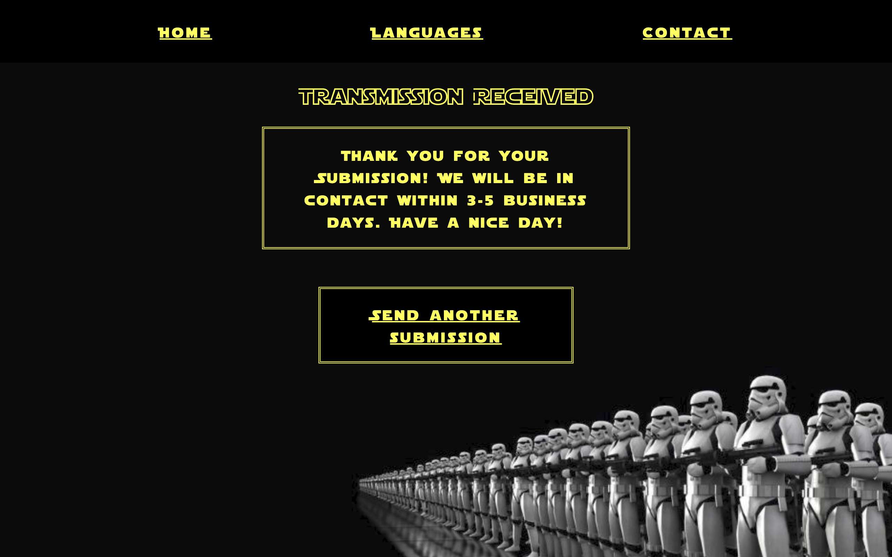

## Translation Fixation

Emily Knowles

## What is Translation Fixation?

Are you a nerd? Are you boring and looking for a little razzle-dazzle to your personality? If you were a spice would you be flour? Have you ever wanted to impress your fellow friends in the Tolkien fandom with your knowledge of the elvish languages but had no idea how? Is Yoda your spirit Jedi but you can’t wrap your head around how he makes his sentences all backwardsy and epic? Well do we have the app for you! Translation Fixation is the new hip app for spitting lines in your favorite fake or weird languages! Just select what language you want to speak to be taken to that language’s translation page, type in your sentence into the provided box (english only to begin with) and your new fangled sentence will pop up below! From Valyrian to Vulcan, Sith to Sindarin you might as well audition to be on the big screen after you’re done! We even have languages to fit all fetishes! Love pigs? We’ve got Pig-Latin! Love blind people? We’ve got Braille! Love Gru? We’ve got Minion! So come on over all movie-buffs, out-casts, or people just looking for a good time - we’ve got what you need!

## Objective

I wanted to make a fun website about something I'm passionate about. Languages have always fascinated me, and I do love myself some good science fiction, so I chose an API that can translate basic phrases into a language of your choosing.

### Web Views

##### Home Page


##### Language Detail Page


##### Language Translation Page


##### Contact Page


##### Submitted Page


Home Mobile Page | Language Detail Mobile Page | Language Translation Mobile Page
--- | --- | --- |
 |  | 

Contact Mobile Page | Submitted Mobile Page
--- | ---
 | 

## Links

GitHub Repository: https://github.com/KnowlesEmily/translation-fixation

## Technologies Used
* HTML, CSS, JavaScript, React, Axios, JSON
* Node, Express + Middleware

## Code Example

The most challenging part of this project was the fact that it originally wasn't supposed to use a server - as I had not learned about them yet. However, some browsers have a certain policy and some API's are more limiting with calls - such as the one I chose. To quote my instructor: "One of the big challenges in accessing APIs is getting around the browser's "Same Origin Policy". Many of the APIs above require you to make requests from a server instead of the client." So after the server was built we had to make sure it was dynamic to be able to create calls depending on which language the user selected. This was all done in the back end.

```
app.post("/forwarder", async (req, res) => {
    const {text, name} = req.body
    const data = {text}
    try {
        const response = await axios.post(`https://api.funtranslations.com/translate/${name}.json`, data)
        return res.send(response.data)
    } catch(err){
        console.log(err)
    }
})
```

By using a template literal in the HTTP request, we could change out which language API was getting called based on the JSON object that contained each language. However, because the API is still very limiting to free users, only 5 calls can be made an hour.

MVP
* React
* Integrate with an online API
* Use the the Axios library to make client-side HTTP requests
* At least 3 views using React Router
* Code must be kept dry using:
    * Context
    * Render-props
    * Higher order components
* Use lifecycle methods for managing HTTP requests
* Responsive
* The home page will have the nav bar, title with the above describing paragraph, and a “Let’s Get Crackin’!” button that takes you to the languages page. That page will provide instruction on what to do there and photos of some of the characters from the provided languages with the language underneath divided into boxes. Once you click a box, you’ll be taken to that language’s translation page. The page will have the title of the language at the top and the box to enter text below. The submit button will be below. The text will pop up below the submit button once entered. The nav bar will have a “Home” button that takes you to the main page, a “Languages” button that will take you to the language page, and a “Contact” button where suggestions or comments can be submitted.

User Stories
* As a Staw Wars enthusiast, I want to learn mandalorian because it’s the last Star Wars language I don’t know.
* As a wannabe Jedi, I want to speak like Yoda so that when my friends don’t ask me for advice I can give it anyway and still sound smart and knowledgeable.
* As Orlando Bloom, I want speak like a pirate so that I can recruit other pirates to help me rescue my girlfriend from buccaneers with a lame agenda.
* As Peter Quill, I want Speak Groot so that I can show that lame love child of a pirate and an angel Thor that he’s not all that.

## Future Ideas

* Currently the "Contact" page's submission feature isn't actually submitting anything. I want to actually collect submissions.

* Because of the API's limitations, you can only make 5 calls an hour if you don't want to pay (and I don't) so maybe I'll create my own API or research other solutions.

* I had a hard time with the CSS animation for the Star Wars crawl on the home page. I want to figure out how to get it to begin from below the bottom of the page.

* Not all of the individual language API's are in working order so I need to check and update which languages are available and put in a catch for when one is unavailable.